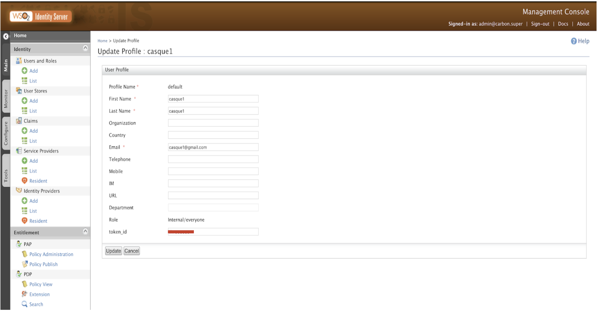

# CASQUE SNR Authenticator

The CASQUE SNR authenticator allows you to integrate WSO2 Identity Server with CASQUE SNR so that you can use the CASQUE SNR multi-factor authentication technology to authenticate users.

The CASQUE SNR multi-factor authentication technology is based on the challenge-response protocol where users possess a token that computes the required response to a given challenge. Tokens can be in a variety of forms such as optical, USB, contact and contactless smart-card as well as surrogate tokens. All token forms have the same highest level secure processor chips rated at EAL6. There are options for client and client-less architectures as well.

Integrating CASQUE SNR with WSO2 Identity Server provides high grade identity assurance to a cloud of Web application services. This means that even if your data is distributed across diverse cloud platforms, you get to determine who can access your data resources on the cloud. 

Unlike OTP tokens, CASQUE SNR tokens can be completely refreshed. Therefore, you can reuse tokens from a pool to provide identity as a service to managed service providers. 

Now that you understand the purpose of the CASQUE SNR authenticator, let’s have a look at how to configure the CASQUE SNR authenticator with WSO2 Identity Server to perform multi-factor authentication.

# Prerequisites

* Download [WSO2 Identity Server](https://wso2.com/identity-and-access-management) and install the product. For detailed installation instructions, see the [Installation Guide](https://docs.wso2.com/display/IS540/Installation+Guide).
>> Let's refer to the WSO2 Identity Server installation location as <IS_HOME> throughout this document.
* Get the complete CASQUE SNR system from [DMS (Distributed Management Systems)](http://www.casque.co.uk/) or its systems integrator. The complete CASQUE SNR system is required to authenticate users using the CASQUE SNR multi-factor authentication technology, and includes the following:
  * SAS software to initially populate the tokens.
  >> The SAS software allows you to initially populate the blank tokens. This ensures that DMS or its systems integrator can never be a security risk. For information on how to install and deploy the complete CASQUE SNR system, see the documentation.
  * A batch of blank tokens.
  * The CASQUE SNR authentication server software for Linux or Windows operating systems.
  * Appropriate CASQUE SNR player for the client platform.

Once you you have all the prerequisites set up, you can follow the instructions in the topics below to configure the CASQUE SNR multi-factor authenticator with the WSO2 Identity Server:

* [Downloading and deploying CASQUE SNR artifacts](#downloading-and-deploying-casque-snr-artifacts)
* [Configuring WSO2 Identity Server](#configuring-wso2-identity-server)

# Downloading and deploying CASQUE SNR artifacts

Follow the steps below to download and deploy the CASQUE-SNR authenticator and related artifacts:

1. Go to [WSO2 Store](https://store.wso2.com/store/assets/isconnector/details/03fcefc0-9c8e-4c2d-ae61-d0b04563d50f) and click **Download Authenticator**. This downloads the org.wso2.carbon.identity.casque.authenticator_1.0.0.jar file.
>> WSO2 Identity Server versions 5.4.0 and above support CASQUE SNR authenticator version 1.0.0.
2. Copy the downloaded org.wso2.carbon.identity.casque.authenticator_1.0.0.jar file to the <IS_HOME>/repository/components/dropins directory.
3. Go to [WSO2 Store](https://store.wso2.com/store/assets/isconnector/details/03fcefc0-9c8e-4c2d-ae61-d0b04563d50f) and click **Download Artifacts**. This downloads a ZIP file named Artifacts, which you need to unzip to extract the artifact files required in step 4 and 5.  
4. Copy the casque.war file from the Artifacts directory to the <IS_HOME>/repository/deployment/server/webapps directory.
5. Copy the casque.conf file from the Artifacts directory to the <IS_HOME>/repository/conf directory.

# Configuring WSO2 Identity Server

Follow the steps below to configure WSO2 Identity Server:

## Set up required claims

Follow the steps below to set up a mapped claim for the CASQUE SNR authenticator:

1. Start WSO2 Identity Server and access the management console. For detailed instructions on how to start WSO2 Identity Server, see [Running the Product](http://docs.wso2.com/identity-server/Running+the+Product).
2. On the Management console, click **Add** under **Claims**. This displays the **Add New Dialect/Claim** screen.
3. Click **Add Local Claim**.

    

4. On the **Add Local Claim** screen, enter the specified values for the following fields:

    * **Claim URI**:	http://wso2.org/claims/identity/casqueSnrToken
    * **Display Name**: token_id
    * **Description**:	CASQUE SNR Token ID
    * **Mapped Attribute(s)**:
      * **User Store Domain Name**: PRIMARY
      * **Mapped Attribute**: displayName
      >> If the displayName attribute is already in use, you need to map another attribute.
    * **Regular Expression**: ^[a-fA-F0-9]{3} [0-9]{6}$
    * Select **Supported by Default**.

    

5. Click **Add**. This adds token_id under the list of **Available Claims for http://wso2.org/claims**.
6. Edit the displayName claim(or any other attribute that you mapped) from the list of available claims, and specify the following as the **Regular Expression**: ^[a-fA-F0-9]{3} [0-9]{6}$

     

     
     
7. Click **Update**.

Now you have set up the required claims. Now you can configure the service provider.

## Configure the service provider

1. On the **Main** tab of the management console, click **Add** under **Service Providers**.

2. Enter the following values in the specified fields:
   * **Service Provider Name**: casqueAuth
   * **Description**: CASQUE SNR Authenticator      
3. Click **Register**.
4. Expand **Inbound Authentication Configuration**, then expand **OAuth/OpenID Connect Configuration**, and then click **Configure**.
5. In the **Callback Url** field, enter the callback Url of the relying party.

6. Click **Add**.
7. Expand **Local & Outbound Authentication Configuration**.
8. Click **Advanced Configuration**.

9. Click **Add Authentication Step**.
10. Under **Local Authenticators** in **Step 1**, select **basic** and click **Add Authenticator**.
11. Click **Add Authentication Step**.
12. Under **Local Authenticators** in **Step 2**, select **casque_auth** and click **Add Authenticator**.
13. Select **Use subject identifier from this step** under **Step 1**.
14. Select **Use attributes from this step** under **Step 2**.

   

15. Click **Update**. This saves the advanced authentication configuration.
16. Click **Update**. This updates the service provider.  

Now you have configured the service provider. The next step is to create a user.

## Create a user 

1. On the management console, click **Add** under **Users and Roles**.
2. Click **Add New User** and specify appropriate values for the fields:

    
    
3. Click **Next** to select roles.
4. Select **Application/casqueAuth**.

    

5. Click **Finish**. This displays the **Users** screen that lists the user you created.
6. Click **User Profile** on the user record that you created.
7. In the user profile specify the following:
   * Enter the **First Name** and **Email**.
   * Enter the **token_id** that is allocated to the user.

    

8. Click **Update**.	

Now you need to perform the CASQUE SNR configurations. 

## Configure CASQUE SNR

1. Edit the casque.conf file in the <IS_HOME>/repository/conf directory to associate the appropriate IP address, port and secret of the accompanying CASQUE SNR authentication server.
2. Restart WSO2 IS Server.

Once you complete all the configurations given above, you can perform user authentication with the CASQUE SNR authenticator.
